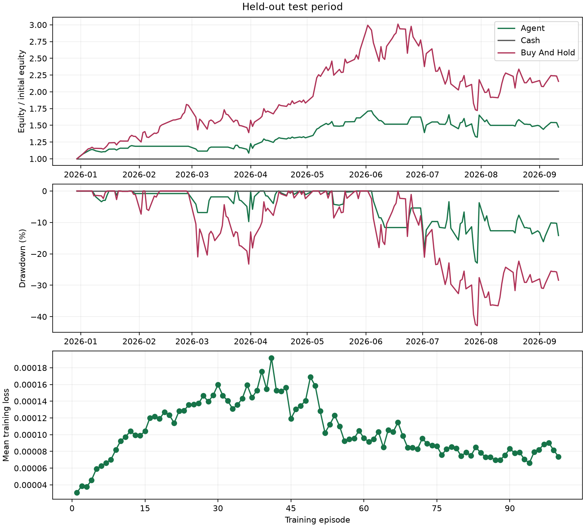

# Held-out test

Mode: train
Algorithm: dqn
Best episode: 24

| Strategy | Return | MDD | Sharpe | Sortino | Trades | Turnover | Avg Holding Days |
|---|---:|---:|---:|---:|---:|---:|---:|
| agent | 47.32% | 22.95% | 1.309 | 2.324 | 76 | 39.033 | 3.343 |
| cash | 0.00% | 0.00% | null | null | 0 | 0.000 | null |
| buy_and_hold | 115.60% | 42.87% | 1.736 | 2.741 | 1 | 0.998 | null |

Equity is marked at the final close without forced liquidation.
Zero-risk Sharpe/Sortino and no-closed-position holding time are undefined (null).

