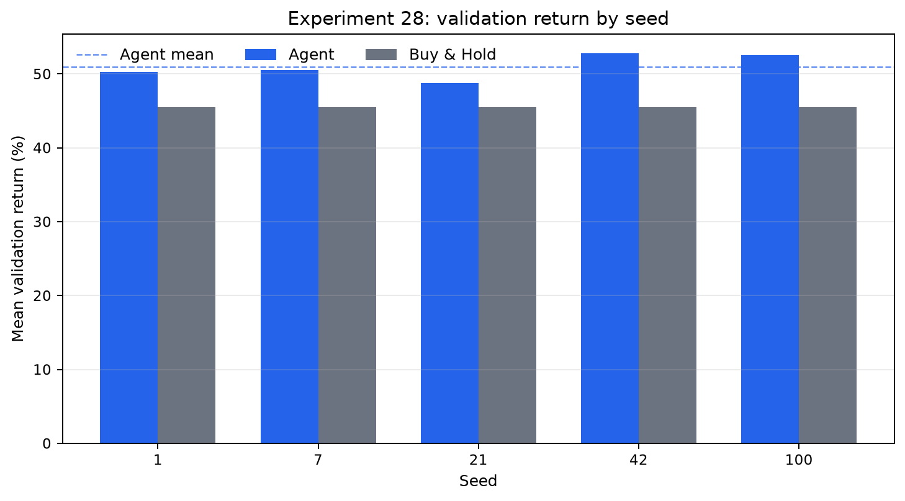
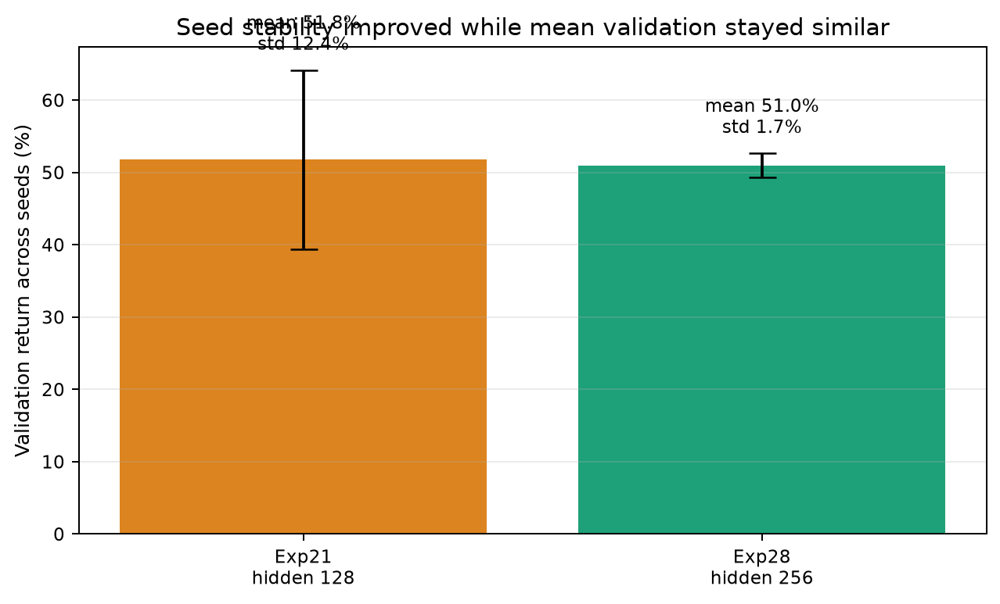
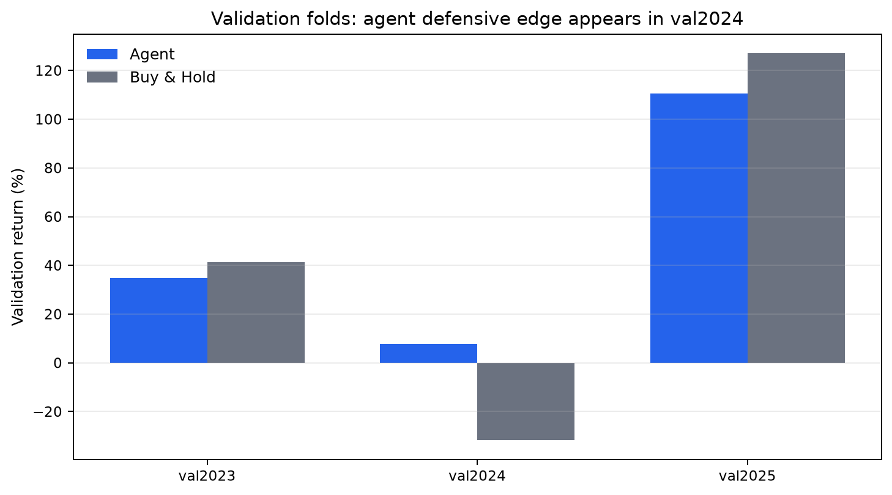
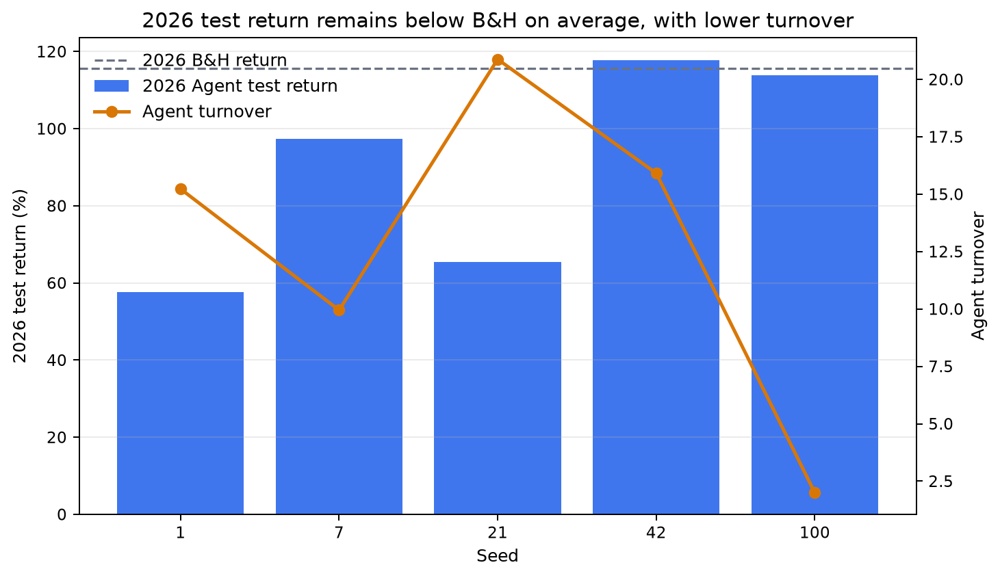
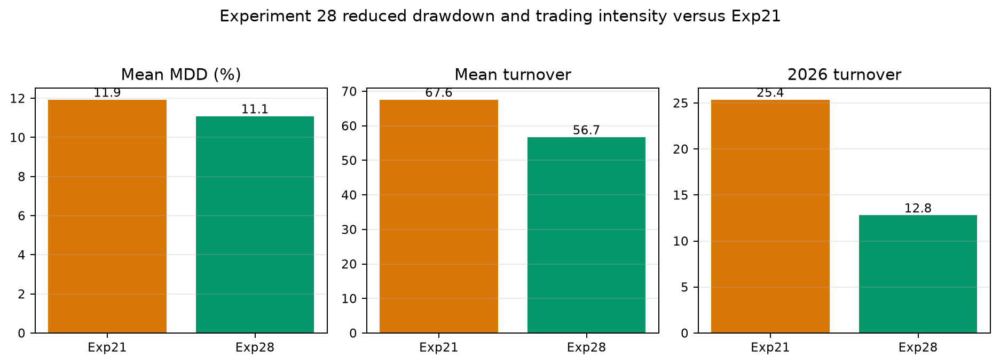

# 실험28 보고서: hidden_dim=256은 수익률보다 안정성을 크게 개선했다

작성일: 2026-09-11  
대상 실험: `실험28_hidden-256-multiseed`  
선택 기준: validation 누적수익률 기준 best episode 선택

## Executive Summary

실험28은 실험27의 하이퍼파라미터를 기반으로 seed 5개를 돌린 multi-seed 검증이다. 결과적으로 Agent의 평균 validation 수익률은 `51.00%`로 buy and hold의 `45.54%`를 상회했다.

가장 중요한 개선은 seed 안정성이다. 이전 multi-seed 기준인 실험21의 seed 간 validation 표준편차는 `12.40%`였지만, 실험28은 `1.65%`까지 낮아졌다. 평균 수익률은 크게 늘지 않았지만, seed에 따른 결과 흔들림은 대폭 줄었다.

다만 2026 test 평균 수익률은 Agent `90.41%`, buy and hold `115.60%`로 test 구간에서는 buy and hold를 이기지 못했다. 따라서 실험28은 "최고 수익률 모델"이 아니라 "현재까지 가장 안정적인 최종 후보"로 보는 것이 적절하다.

## 사용된 하이퍼파라미터

| 구분 | 값 |
|---|---:|
| Algorithm | `dqn` |
| Hidden dim | `256` |
| Optimizer | `adam` |
| Loss | `huber` |
| Learning rate | `0.001` |
| Gamma | `0.99` |
| Batch size | `32` |
| Replay buffer size | `20000` |
| Target update interval | `500` |
| Epsilon start | `1.0` |
| Epsilon min | `0.05` |
| Epsilon decay | `0.999` |
| Episodes | `100` |
| Learning starts | `256` |
| Train frequency | `1` |
| Gradient steps | `1` |
| Action values | `[0.0, 0.5, 1.0]` |
| Initial balance | `10,000,000` |
| Commission | `0.015%` |
| Tax | `0.25%` |

## 실험 설계

| 항목 | 내용 |
|---|---|
| 사용 seed | `1`, `7`, `21`, `42`, `100` |
| Fold 1 | train: 2023년 이전, validation: 2023년, test: 2024년 이후 |
| Fold 2 | train: 2024년 이전, validation: 2024년, test: 2025년 이후 |
| Fold 3 | train: 2025년 이전, validation: 2025년, test: 2026년 이후 |
| 모델 선택 기준 | 각 fold에서 validation 누적수익률이 가장 높은 episode |
| 비교 기준 | buy and hold |

## 핵심 결과

| 지표 | Agent 실험28 | Buy and Hold |
|---|---:|---:|
| 평균 validation 수익률 | `51.00%` | `45.54%` |
| 평균 worst validation 수익률 | `7.75%` | 구간별 상이 |
| 평균 validation Sharpe | `1.665` | 구간별 상이 |
| 평균 validation MDD | `11.08%` | 약 `22.54%` |
| 평균 validation turnover | `56.706` | `0.996` |
| 평균 2026 test 수익률 | `90.41%` | `115.60%` |
| 2026 test 수익률 표준편차 | `27.54%` | seed 영향 없음 |
| 평균 2026 test turnover | `12.793` | `0.998` |

## Seed별 validation 수익률

모든 seed에서 Agent의 평균 validation 수익률은 buy and hold 평균을 넘었다. seed 42가 `52.77%`로 가장 높았고, 가장 낮은 seed 21도 `48.82%`로 buy and hold 평균 `45.54%`보다 높았다.

| Seed | Agent 평균 Val | Buy and Hold 평균 Val | Worst Val | 평균 MDD | 평균 Turnover | 2026 Test |
|---:|---:|---:|---:|---:|---:|---:|
| 1 | `50.33%` | `45.54%` | `10.65%` | `11.95%` | `68.824` | `57.70%` |
| 7 | `50.52%` | `45.54%` | `8.13%` | `12.16%` | `56.480` | `97.37%` |
| 21 | `48.82%` | `45.54%` | `6.54%` | `10.51%` | `61.843` | `65.47%` |
| 42 | `52.77%` | `45.54%` | `9.11%` | `10.51%` | `47.860` | `117.72%` |
| 100 | `52.55%` | `45.54%` | `4.31%` | `10.29%` | `48.523` | `113.79%` |

## Seed 안정성 비교

실험28의 가장 큰 장점은 seed별 성능 편차를 줄였다는 점이다. 실험21은 평균 validation 수익률이 `51.76%`로 실험28보다 약간 높았지만, seed 간 표준편차가 `12.40%`였다. 실험28은 평균 validation 수익률 `51.00%`를 유지하면서 표준편차를 `1.65%`까지 낮췄다.

이 결과는 hidden_dim을 `128`에서 `256`으로 키운 것이 수익률 자체를 크게 올리지는 않았지만, 학습 경로가 seed에 따라 크게 갈리는 문제를 완화했다는 뜻으로 해석할 수 있다.

## Fold별 validation 해석

Fold별로 보면 Agent의 장점은 2024 validation 구간에서 가장 뚜렷하다. buy and hold는 2024 validation에서 평균 `-31.76%`였지만, Agent는 seed 평균으로 플러스 수익률을 유지했다.

| Fold | Agent 평균 Val | Buy and Hold Val | 해석 |
|---|---:|---:|---|
| val2023 | 약 `34.78%` | `41.39%` | 상승 구간에서는 B&H가 우위 |
| val2024 | 약 `7.75%` | `-31.76%` | Agent의 방어력이 가장 잘 드러난 구간 |
| val2025 | 약 `110.47%` | `126.99%` | 강한 상승 구간에서는 B&H가 우위 |

이 패턴은 Agent가 강한 상승장을 전부 따라가기보다는 하락 또는 변동 구간에서 손실을 줄이는 방향으로 학습되었음을 시사한다.

## 2026 Test 결과

2026 test에서는 buy and hold가 Agent 평균을 앞섰다. Agent 평균 test 수익률은 `90.41%`, buy and hold는 `115.60%`였다. 다만 Agent의 test 결과 표준편차는 실험21 대비 낮아졌고, turnover도 크게 줄었다.

즉 실험28은 test 구간에서 초과수익을 만들지는 못했지만, seed별 test 결과 편차와 거래 강도를 줄이는 방향으로 개선되었다.

## 실험21 대비 위험과 거래 강도

실험28은 실험21 대비 평균 MDD, validation turnover, 2026 test turnover를 모두 낮췄다.

| 지표 | 실험21 hidden=128 | 실험28 hidden=256 | 해석 |
|---|---:|---:|---|
| 평균 validation 수익률 | `51.76%` | `51.00%` | 거의 유사 |
| seed 간 validation 표준편차 | `12.40%` | `1.65%` | 실험28이 크게 개선 |
| 평균 worst validation | `1.56%` | `7.75%` | 실험28이 개선 |
| 평균 validation MDD | `11.93%` | `11.08%` | 실험28이 소폭 개선 |
| 평균 validation turnover | `67.583` | `56.706` | 실험28이 개선 |
| 평균 2026 test 수익률 | `99.46%` | `90.41%` | 실험21이 우위 |
| 2026 test 표준편차 | `51.47%` | `27.54%` | 실험28이 개선 |
| 평균 2026 test turnover | `25.363` | `12.793` | 실험28이 개선 |

## 결론

실험28은 validation 기준으로 buy and hold를 상회했고, seed 간 표준편차를 크게 줄였다. 따라서 현재까지의 실험 중에서는 안정성 기준 최종 후보로 채택할 수 있다.

다만 2026 test 수익률은 buy and hold보다 낮았다. 이 때문에 실험28을 "완성된 최종 모델"로 확정하기보다는, "안정성이 검증된 기준 모델"로 두고 다음 실험에서 수익률 개선을 시도하는 것이 적절하다.

## 다음 실험 방향

1. 실험28 기반으로 수익률을 끌어올리는 방향을 먼저 본다.
2. 후보 파라미터는 `learning_rate=0.0007` 또는 `hidden_dim=192`가 적절하다.
3. 단일 seed로 개선 후보를 찾은 뒤, 유의미하면 다시 multi-seed로 검증한다.
4. 최종 판단은 validation 평균, seed 표준편차, worst validation, MDD, turnover를 함께 본다.

## 최종 판단 문장

실험28은 `hidden_dim=256`, `batch_size=32`, `Huber loss` 조합을 사용한 multi-seed walk-forward 검증에서 buy and hold 대비 validation 평균 수익률을 개선했고, seed 간 성능 표준편차를 크게 낮췄다. 따라서 현재까지는 안정성 기준 최종 후보로 채택할 수 있다. 단, 2026 test 구간에서는 buy and hold 대비 초과수익을 보이지 못했으므로, 이후 실험은 이 안정성을 유지하면서 test 수익률을 개선하는 방향으로 진행해야 한다.
