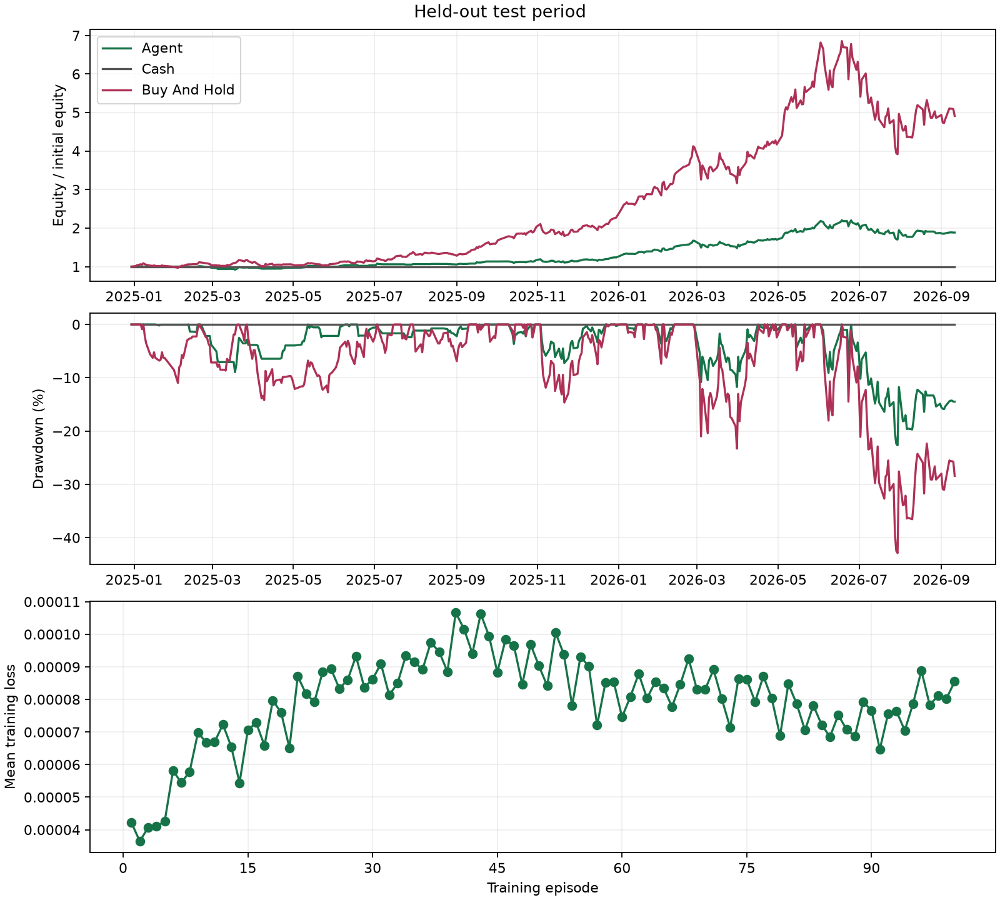

# Held-out test

Mode: train
Algorithm: dqn
Best episode: 43

| Strategy | Return | MDD | Sharpe | Sortino | Trades | Turnover | Avg Holding Days |
|---|---:|---:|---:|---:|---:|---:|---:|
| agent | 88.35% | 22.66% | 1.435 | 2.267 | 202 | 56.686 | 3.394 |
| cash | 0.00% | 0.00% | null | null | 0 | 0.000 | null |
| buy_and_hold | 390.84% | 42.87% | 1.885 | 3.004 | 1 | 0.996 | null |

Equity is marked at the final close without forced liquidation.
Zero-risk Sharpe/Sortino and no-closed-position holding time are undefined (null).

