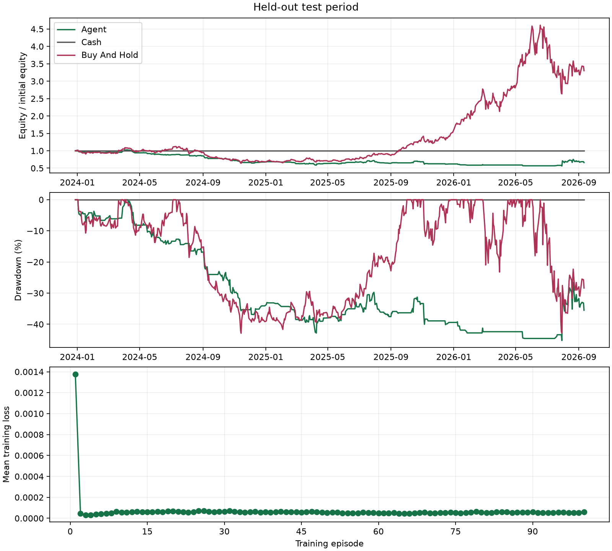

# Held-out test

Mode: train
Algorithm: double_dqn
Best episode: 54

| Strategy | Return | MDD | Sharpe | Sortino | Trades | Turnover | Avg Holding Days |
|---|---:|---:|---:|---:|---:|---:|---:|
| agent | -33.90% | 45.23% | -0.497 | -0.835 | 218 | 196.835 | 1.725 |
| cash | 0.00% | 0.00% | null | null | 0 | 0.000 | null |
| buy_and_hold | 230.24% | 42.91% | 1.132 | 1.767 | 1 | 0.993 | null |

Equity is marked at the final close without forced liquidation.
Zero-risk Sharpe/Sortino and no-closed-position holding time are undefined (null).

