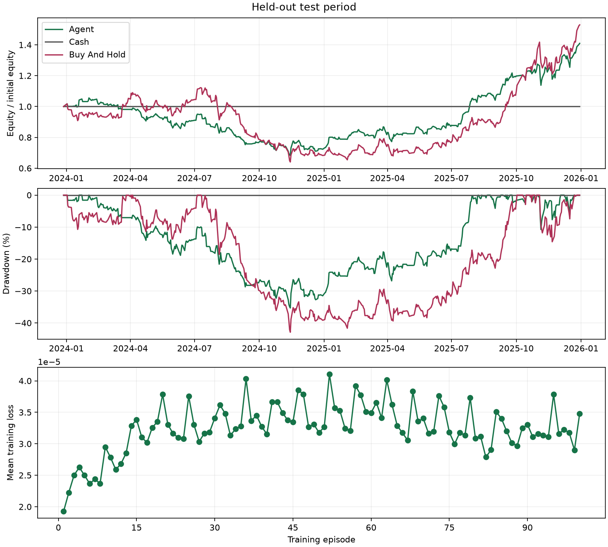

# Held-out test

Mode: train
Algorithm: dqn
Best episode: 5

| Strategy | Return | MDD | Sharpe | Sortino | Trades | Turnover | Avg Holding Days |
|---|---:|---:|---:|---:|---:|---:|---:|
| agent | 40.96% | 35.32% | 0.847 | 1.311 | 291 | 206.432 | 2.635 |
| cash | 0.00% | 0.00% | null | null | 0 | 0.000 | null |
| buy_and_hold | 52.94% | 42.91% | 0.830 | 1.259 | 1 | 0.993 | null |

Equity is marked at the final close without forced liquidation.
Zero-risk Sharpe/Sortino and no-closed-position holding time are undefined (null).

