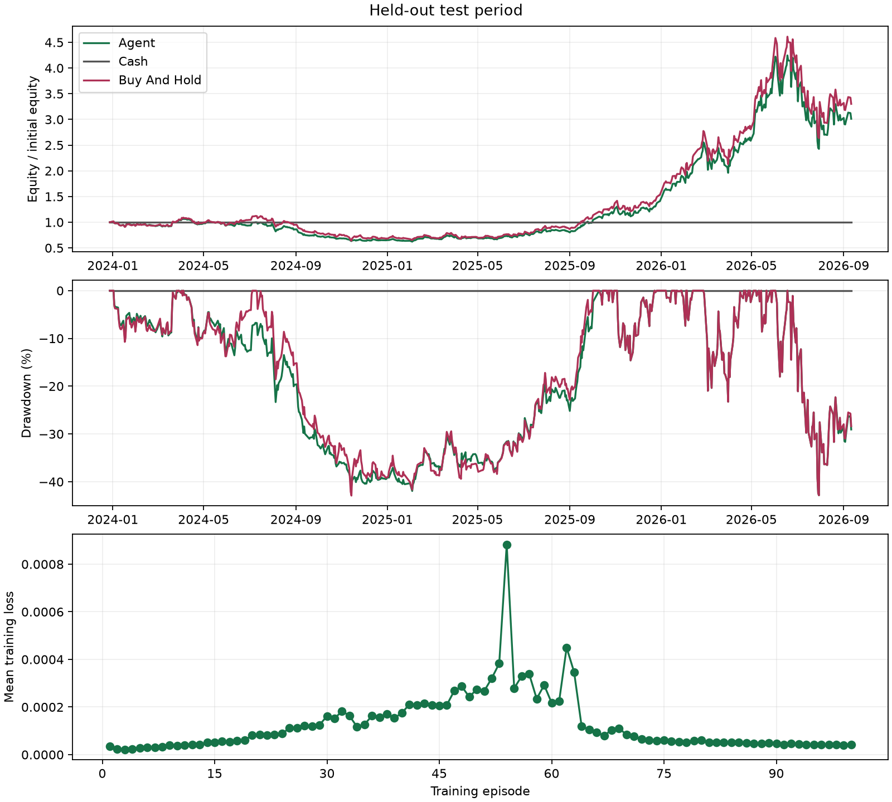

# Held-out test

Mode: train
Algorithm: dqn
Best episode: 51

| Strategy | Return | MDD | Sharpe | Sortino | Trades | Turnover | Avg Holding Days |
|---|---:|---:|---:|---:|---:|---:|---:|
| agent | 201.21% | 42.85% | 1.083 | 1.691 | 196 | 82.061 | 13.654 |
| cash | 0.00% | 0.00% | null | null | 0 | 0.000 | null |
| buy_and_hold | 230.24% | 42.91% | 1.132 | 1.767 | 1 | 0.993 | null |

Equity is marked at the final close without forced liquidation.
Zero-risk Sharpe/Sortino and no-closed-position holding time are undefined (null).

